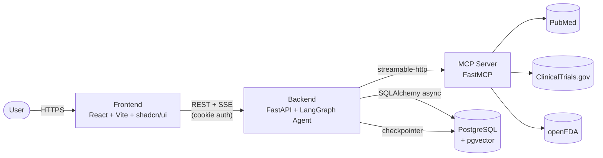
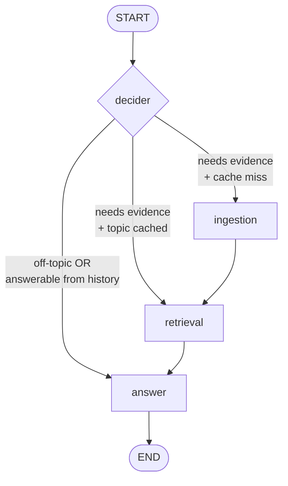

# Biomedical Research Copilot

An **agentic AI research assistant** that answers biomedical questions by searching live evidence from PubMed, ClinicalTrials.gov, and openFDA, then synthesizing **citation-backed** answers — streamed to the user in real time.

Ask about research landscapes, drug safety, clinical-trial status, or disease mechanisms. The assistant decides what evidence it needs, fetches it from public biomedical databases through a dedicated **MCP server**, caches it semantically, and returns a grounded, sourced answer.

> ⚠️ **Disclaimer:** This is a research aid, **not medical advice**. Outputs are generated from public databases and an LLM, and may be incomplete or out of date. Always consult primary sources and qualified professionals.

---

## Table of Contents

- [Features](#features)
- [Architecture](#architecture)
- [How the Agent Works](#how-the-agent-works)
- [The MCP Server](#the-mcp-server)
- [Tech Stack](#tech-stack)
- [Project Structure](#project-structure)
- [Getting Started](#getting-started)
- [Environment Variables](#environment-variables)
- [Running Locally](#running-locally)

---

## Features

- **Agentic multi-source RAG** — a LangGraph pipeline that routes each query, fetches evidence only when needed, and synthesizes a cited answer.
- **Three live biomedical data sources** — PubMed (literature), ClinicalTrials.gov v2 (trials), and openFDA (adverse events + drug labels), exposed through a standalone MCP server.
- **Citation-backed answers** — every answer ends with a sources list; the model is constrained to only cite evidence actually retrieved.
- **Topic-aware caching** — fetched evidence is stored in a pgvector store and reused for similar future questions within a freshness window, avoiding redundant API calls.
- **Real-time token streaming** — answers stream token-by-token to the frontend over Server-Sent Events (SSE).
- **Per-conversation memory** — each chat is a LangGraph thread with its own checkpointed state, so follow-ups understand prior context.
- **Cookie-based JWT auth** — secure HttpOnly cookie sessions, multi-user, with per-user chat history.
- **Relevance guardrail** — off-topic questions are politely declined and redirected.

---

## Architecture

The system is composed of **three independently deployed services** plus a Postgres database.



**Why a separate MCP server?** Data access is decoupled from the agent. The MCP server is a reusable tool layer (any MCP-compatible client can use it), it can be scaled and deployed independently, and it keeps the agent's codebase focused on reasoning rather than API plumbing.

---

## How the Agent Works

The agent is a **LangGraph state machine** with four nodes and conditional routing.



**Nodes**

1. **`decider`** — an LLM call with structured output that decides three things:
   - `relevant` — is the query in biomedical scope?
   - `needs_retrieval` — does it require *new* evidence, or can it be answered from the conversation so far?
   - `refined_query` — a standalone restatement with references (e.g. "those trials") resolved from history.
   - It then runs a **cache check** (`pgvector` similarity search) to decide whether the needed evidence is already stored and fresh.

2. **`ingestion`** (cache miss) — selects the right MCP tools for the query, calls them **in parallel** (`asyncio.gather`), normalizes results into documents, embeds them, and stores them in pgvector with metadata (source, topic, `fetched_at`).

3. **`retrieval`** — runs a max-marginal-relevance search over pgvector to pull the most relevant, diverse chunks for the refined query.

4. **`answer`** — synthesizes a calibrated-length, cited answer from the retrieved evidence and conversation history, streaming tokens out. The system prompt forbids leaking internal mechanics ("context"), enforces a sources-at-the-end format, and applies safety framing (adverse events as "most reported," forecasts labeled as extrapolation).

**Routing logic**

| Condition | Route |
|---|---|
| Not relevant, or answerable from history | `answer` (no fetch) |
| Needs evidence **and** topic already cached & fresh | `retrieval` (skip fetch) |
| Needs evidence **and** cache miss | `ingestion` → `retrieval` → `answer` |

**Two memory systems** (kept separate by design):

- **Checkpointer** (per `thread_id`) — the conversation memory for a single chat.
- **pgvector store** (global) — the shared knowledge cache of biomedical evidence already fetched, reusable across all chats and users.

A new chat resets the conversation, **not** the knowledge cache.

---

## The MCP Server

A standalone [FastMCP](https://github.com/jlowin/fastmcp) server (`streamable-http` transport) exposing four tools over three public APIs:

| Tool | Source | Purpose |
|---|---|---|
| `search_literature` | PubMed (NCBI E-utilities) | Find and summarize published research |
| `search_trials` | ClinicalTrials.gov v2 | Surface ongoing & completed clinical trials |
| `get_adverse_events` | openFDA FAERS | Most-reported adverse events for a drug |
| `get_drug_label` | openFDA Drug Label | Indications, warnings, dosing, contraindications |

The agent connects via `langchain-mcp-adapters` and dynamically selects which tools to call per query.

---

## Tech Stack

**Agent & Backend**
- Python, FastAPI (async)
- LangGraph (agent orchestration) + `langgraph-checkpoint-postgres` (persistent state)
- Google Gemini 2.5 Flash (reasoning & synthesis)
- `gemini-embedding-001` embeddings (768-dim)
- LangChain PGVector (vector store) over PostgreSQL + `pgvector`
- SQLAlchemy 2.0 async + psycopg 3
- JWT (PyJWT) + bcrypt, HttpOnly cookie sessions
- Server-Sent Events for streaming

**MCP Server**
- FastMCP (`streamable-http`)
- PubMed, ClinicalTrials.gov v2, openFDA

**Frontend**
- React + Vite + TypeScript
- Tailwind CSS v4 + shadcn/ui (Radix primitives)
- React Router, React Context (state)
- `fetch` + `ReadableStream` for SSE consumption

**Infrastructure**
- Supabase (managed PostgreSQL + pgvector)
- Render (all three services)

---

## Project Structure

```
Medical_Research_Agent/
├── backend/
│   ├── main.py                 # FastAPI app + lifespan (builds agent + checkpointer)
│   ├── config.py               # env vars, cookie + DB config
│   ├── database.py             # async SQLAlchemy engine + session
│   ├── models.py               # User, Chat, Message tables
│   ├── schemas.py              # Pydantic request/response models
│   ├── security.py             # password hashing, JWT, get_current_user
│   ├── router/
│   │   ├── auth.py             # register / login / logout / me
│   │   └── chat.py             # chat CRUD + messages + streaming
│   ├── ai/
│   │   ├── graph.py            # build_graph() + routing
│   │   ├── langgraph_entry.py  # graph instance for `langgraph dev`
│   │   ├── state.py            # ResearchState + structured-output schema
│   │   ├── nodes/              # decider, ingestion, retrieval, answer
│   │   ├── vectorstore.py      # PGVector instance
│   │   ├── mcp_client.py       # MCP client factory
│   │   ├── config.py           # LLM + embedding clients
│   │   └── langgraph.json      # LangGraph Studio config
│   ├── pyproject.toml
│   └── uv.lock
├── mcp-server/                 # standalone MCP service
│   └── main.py                 # FastMCP server + the 4 tools
└── frontend/
    ├── src/
    │   ├── lib/api.ts           # fetch wrapper (credentials: include)
    │   ├── context/             # AuthContext, ChatContext
    │   ├── pages/               # LandingPage, Login, Register, ChatPage
    │   └── components/          # chat/, landing/, ui/ (shadcn)
    ├── package.json
    └── vite.config.ts
```

---

## Getting Started

### Prerequisites

- Python 3.12+ and [uv](https://docs.astral.sh/uv/)
- Node.js 18+ and npm
- A PostgreSQL database with the `pgvector` extension (e.g. [Supabase](https://supabase.com))
- A Google Gemini API key

### 1. Database

Enable pgvector once:

```sql
CREATE EXTENSION IF NOT EXISTS vector;
```

The app's relational tables (`users`, `chats`, `messages`) and the pgvector tables are created automatically on first run.

### 2. Clone & configure

```bash
git clone https://github.com/<you>/Medical_Research_Agent.git
cd Medical_Research_Agent
```

Set up the environment variables (see below) in each service.

---

## Environment Variables

**Backend** (`backend/.env`)

| Variable | Required | Description |
|---|---|---|
| `DATABASE_URL` | ✅ | `postgresql+psycopg://...` — use the Supabase **pooler** host |
| `SECRET_KEY` | ✅ | Random string for signing JWTs |
| `GOOGLE_API_KEY` | ✅ | Gemini API key |
| `MCP_SERVER_URL` | ✅ | URL of the MCP server (e.g. `http://localhost:10000/mcp` locally) |
| `COOKIE_SECURE` | prod | `true` in production (HTTPS) |
| `COOKIE_SAMESITE` | prod | `none` for cross-domain prod; `lax` locally |

**Frontend** (`frontend/.env`)

| Variable | Required | Description |
|---|---|---|
| `VITE_API_URL` | ✅ | Backend base URL (build-time) |

**MCP Server** (optional)

| Variable | Required | Description |
|---|---|---|
| `NCBI_API_KEY` | optional | Raises PubMed rate limits |
| `OPENFDA_API_KEY` | optional | Raises openFDA rate limits |

---

## Running Locally

Run the three services in separate terminals.

**1. MCP server**
```bash
cd mcp-server
uv run main.py          # serves http://localhost:10000/mcp
```

**2. Backend**
```bash
cd backend
uv sync
uv run uvicorn main:app --reload     # http://127.0.0.1:8000  (docs at /docs)
```

**3. Frontend**
```bash
cd frontend
npm install
npm run dev             # http://localhost:5173
```

> Set `MCP_SERVER_URL=http://localhost:10000/mcp` in the backend `.env` for local development.

**Optional — inspect the agent graph** with LangGraph Studio:
```bash
cd backend/ai
uv run langgraph dev
```

---
*Built as a full-stack agentic AI portfolio project. Research aid only — not medical advice.*